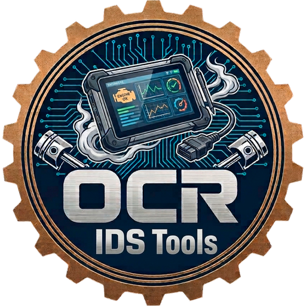

  

<h1 align="center">OCR IDS Tools</h1>

  Integrated Diagnostic Suite: suite de diagnóstico de taller para Windows. 
  OBD-II/UDS multimarca, cuadros VAG por línea K, BMW K+DCAN, Renault con base DDT2000 y TPMS,
  en una pantalla de mosaicos al estilo de los equipos de taller.

  
  

---

## Descarga e instalación

En [Releases](../../releases) está `OCR_IDS_Tools_Setup_<versión>.exe`. Se instala **para el
usuario actual, sin permisos de administrador**, en `%LOCALAPPDATA%\Programs\OCR IDS Tools`.

El instalador **no va firmado** con certificado de código: SmartScreen puede avisar la primera
vez («Más información → Ejecutar de todas formas»). Cada release lleva el SHA-256 del fichero
para comprobarlo.

## Actualizaciones automáticas

El programa comprueba una vez al día (o con «Buscar actualizaciones») el manifiesto
`actualizacion.json` de la última release de este repositorio. Solo instala una versión si el
manifiesto está **firmado con la clave de OCR IT Support** y el instalador descargado coincide
en tamaño y SHA-256; después se actualiza en silencio y vuelve a abrirse solo. El canal se puede
cambiar en Ajustes → Actualizaciones (por ejemplo a una carpeta de red para un taller sin
internet).

## Qué hay dentro

| Mosaico | Qué hace |
|---|---|
| **Autodiagnosis / Módulos / Datos en vivo** | OBD-II y UDS multimarca por ELM327 (USB, Bluetooth, WiFi), Carly, OBDLink, ENET (BMW) y cables J2534. Base de más de 18.000 averías con texto en español. |
| **VAG (línea K, cable KKL)** | Diagnóstico y adaptaciones por KW1281 con el kw1281test integrado. |
| **Cluster Editor** | Cuadros de instrumentos VAG: lectura y grabación de EEPROM, codificación, adaptaciones. |
| **BMW** | K+DCAN (D-CAN y DS2) y ENET. |
| **Renault** | Con la base DDT2000 del usuario. |
| **TPMS Tools** | Escáner de sensores con RTL-SDR (rtl_433 integrado) y banco de pruebas con ESP32 (firmware y grabación incluidos). |
| **Mis programas** | Mosaicos para abrir el resto de programas de diagnóstico del PC (VCDS, INPA, CLIP, DiagBox, FORScan…), con la carpeta de trabajo correcta. |

**Modo terminal**: puede sustituir el escritorio de Windows del usuario del taller para que el
equipo arranque directamente en la suite (se quita desde el propio programa o al desinstalar).

## Requisitos

Windows 10 u 11 de 64 bits. Para los cables J2534 hace falta además un Python de 32 bits
(el programa avisa y lo explica). Nada más.

---

OCR IT Support

